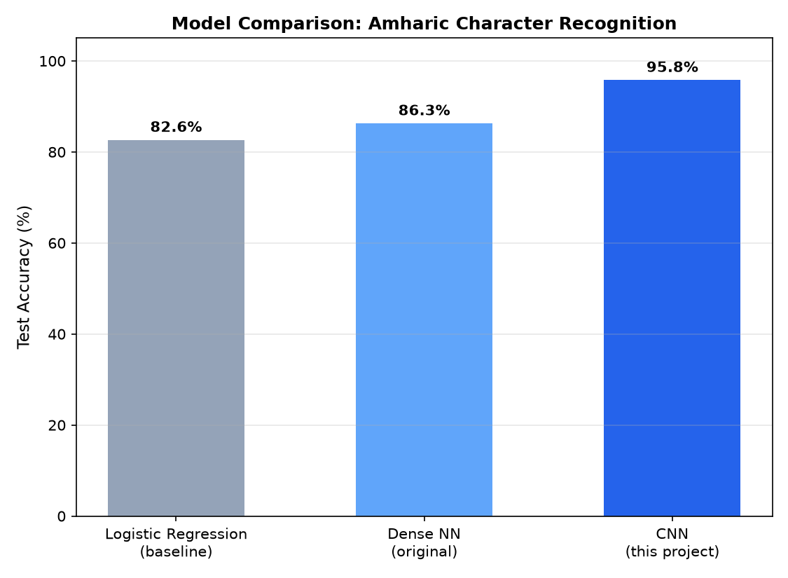
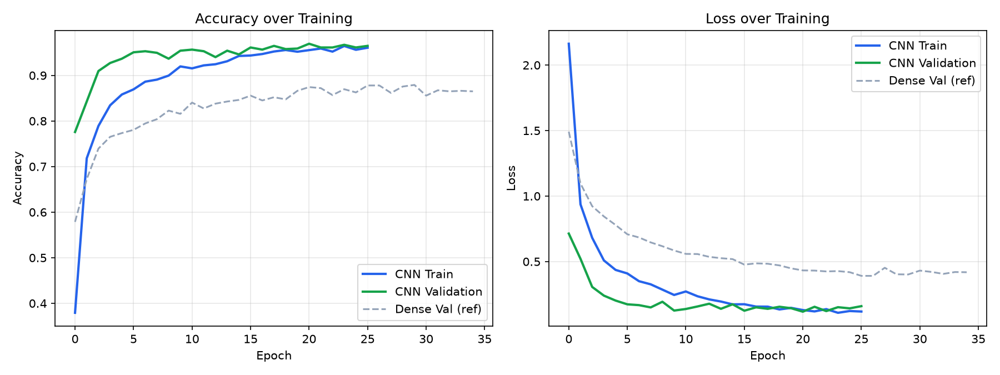
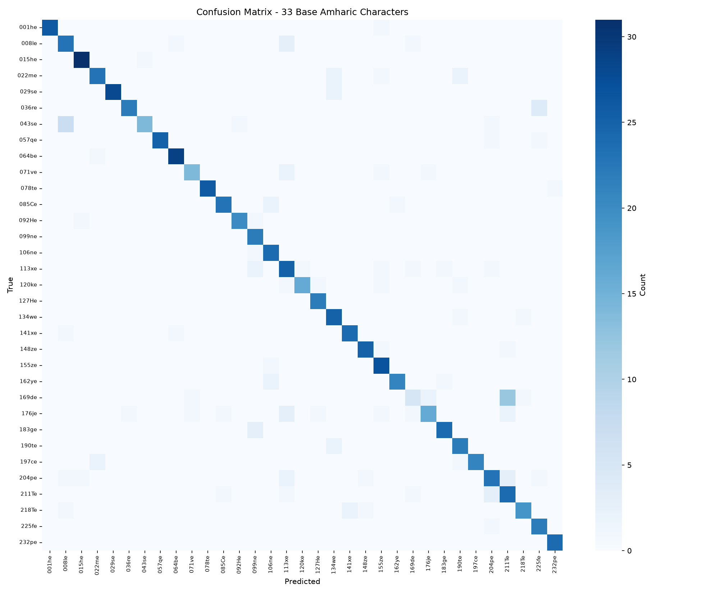
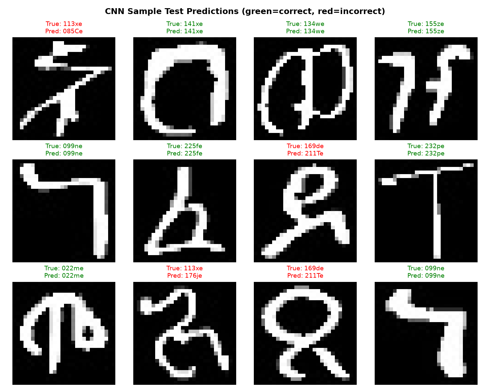

# Amharic Handwritten Character Recognition

A neural network that classifies handwritten Amharic characters, built to
practice neural network fundamentals (forward propagation, dense layers,
softmax classification) while tackling a real, underserved problem: Amharic
handwriting recognition, an area with far less tooling and research
attention than Latin-script OCR.

## Why this scope

Amharic's full script (Ge'ez/Fidel) has 33 base consonants, each written in
7 vowel-modified forms ("orders") — 231+ total character shapes. This
project deliberately scopes down to the **33 base (first-order) characters
only**. This keeps the model, a plain dense neural network, appropriately
matched to the problem's complexity, while still tackling a real
classification task grounded in actual research datasets rather than a toy
problem like MNIST.

## Results

| Model | Test Accuracy |
|---|---|
| Logistic Regression (baseline) | 82.4% |
| Dense Neural Network | 86.3% |
| **Convolutional Neural Network (CNN)** | **95.8%** |



The dense neural network achieved an 86.3% test accuracy (~3.9 percentage
points over the linear baseline). Upgrading to a CNN yielded a substantial leap
to **95.77% test accuracy** (+9.5 pp over Dense NN, +13.4 pp over baseline).
Across 3 runs with different random seeds, CNN test accuracy consistently
ranged from **95.4% to 96.5%** (averaging **95.89%**), confirming the stability
of spatial feature learning across initializations.

### Training curves



Validation accuracy tracks *above* training accuracy for most of training —
a signature of the data augmentation (random rotation/translation/zoom)
working as intended: it makes the training task harder, which reduces
overfitting rather than causing it.

### Confusion matrix



Predictions are strongly concentrated on the diagonal (correct), with errors
sharply reduced across all character classes.

**The primary remaining confusion:** ደ (`169de`, `U+12F0`) predicted as ጸ (`211Te`, `U+1338`):
- **Dense NN**: 12 of 21 test instances of ደ (57.1% error rate, 5 of 21 correct)
- **CNN**: 10 of 21 test instances (47.6% error rate, 10 of 21 correct) — doubling correct recognitions from 5 to 10, though this pair remains the model's single largest confusion.

#### Root cause analysis:
A full manual review of all 342 images across both classes ruled out widespread dataset mislabeling (only 2 verified label errors were found and corrected in the dataset). Instead, the confusion is driven by two factors:
1. **Subtle handwritten stroke morphology**: In Amharic handwriting, the loop-to-stem junction is thin/smooth in ጸ versus wider/near-vertical in ደ — a structural nuance that is easily degraded or compressed at 28×28 grayscale resolution.
2. **Class frequency imbalance**: The training split contains 98 examples of ደ versus 142 examples of ጸ (+44.9% more data for ጸ). When strokes are ambiguous, the network's learned prior heavily biases predictions toward the more frequent class.

This is corroborated by the error directionality: misclassifications are strictly **one-directional** (ደ $\to$ ጸ is common, while ጸ $\to$ ደ is 0.0% / 30 of 30 test samples correct for ጸ), consistent with class imbalance rather than symmetric visual confusion.

#### Class-imbalance mitigation experiments:
Two mitigation strategies were tested for the ደ/ጸ imbalance: **class weighting** (inverse frequency) and **targeted oversampling** (augmenting ደ to match ጸ's training count). Across 3 seeds, both improved average ደ accuracy by ~22 pp (50.8% → 73.0%) but traded off a similar amount of ጸ accuracy (98.9% → ~86%), converging on nearly identical results despite using different mechanisms. This suggests the confusion reflects a genuine visual ceiling for these two characters at 28×28 resolution rather than a fixable data-imbalance artifact. The unweighted CNN is kept as the primary model for its stability and stronger majority-class performance.

### Sample predictions



## Approach

1. **Data**: [Handwritten Amharic character dataset](https://github.com/Fetulhak/Handwritten-Amharic-character-Dataset)
   (Fetulhak), filtered to the 33 base-order characters — 5,678 images,
   28×28 grayscale, ~172 images/class average.
2. **Forward propagation from scratch** (`src/forward_pass_numpy.py`) — a
   hand-written NumPy implementation of the exact dense-layer math
   (`X · W + b`, ReLU, softmax), verified against course exercises, before
   touching any framework.
3. **Baseline**: logistic regression on flattened pixels, to establish
   what a linear model can already do.
4. **Neural network** (`src/train.py`): Dense NN baseline and multi-layer CNN
   (`Conv2D → Conv2D → MaxPool → Conv2D → Conv2D → MaxPool → Flatten → Dense(128) → Dense(33, softmax)`),
   with on-the-fly data augmentation (rotation, translation, zoom) and early stopping on validation accuracy.
5. **Evaluation** (`src/evaluate.py`): confusion matrix, baseline
   comparison, and misclassification analysis across models.

## Project structure

```
├── README.md
├── requirements.txt
├── LICENSE
├── .gitignore
├── src/
│   ├── preprocess.py           # Load images, split data, train baseline
│   ├── forward_pass_numpy.py   # Hand-written forward pass (no framework)
│   ├── train.py                # Build, train, and save dense/CNN models
│   └── evaluate.py             # Benchmark all models and generate visuals
├── results/                    # Generated metrics, plots, confusion matrix
├── models/                     # Saved trained models (.keras)
└── data/                       # Processed .npy arrays (splits and class names)
```

## Running it

```bash
pip install -r requirements.txt

# 1. Preprocess (expects raw images in data/amharic_base34/<class>/*.jpg)
python src/preprocess.py --data_dir data/amharic_base34

# 2. See the forward pass math in isolation
python src/forward_pass_numpy.py

# 3. Train the model (dense or CNN)
python src/train.py --model cnn

# 4. Generate evaluation visuals & benchmark comparison
python src/evaluate.py
```

## Extended experiment: full 238-class syllabary

The same CNN architecture (unchanged, no added capacity) was trained on the complete Ge'ez Fidel script — all 34 consonants × 7 vowel orders (238 classes, 37,652 images total, 26,356 train / 5,648 val / 5,648 test) rather than just the 33 base consonant forms. A single training run (seed 42) achieved **86.86% test accuracy** — a ~9 pp drop from the 33-class model's 95.89%, despite a >7x increase in classification space (chance level dropping from ~3.03% to ~0.42%). This result is from a single seed rather than the 3-seed stability check used elsewhere in this project, given the substantially longer training time at this scale; it should be read as a representative single run, not a fully verified stable average.

## Data source & license note

Raw images are not redistributed in this repository. The dataset is
publicly available at the link above; see its own repository for licensing
terms. This project's code is released under the license in `LICENSE`.

## Future extensions

- Targeted disambiguation for ደ/ጸ (higher-resolution patches to overcome the 28×28 resolution limit)
- Move from isolated-character to word/sentence-level recognition
- Build a small demo (upload an image, get back predicted text)
